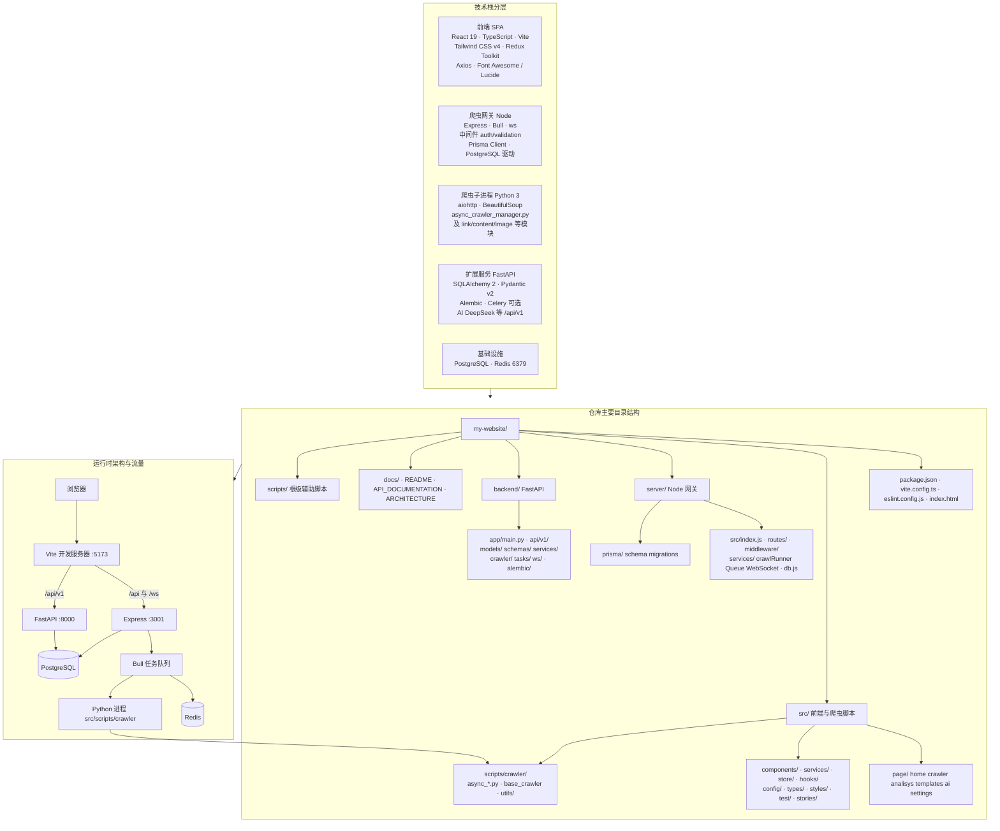

# SpiderX

面向开发与实验的网页爬虫控制台：在浏览器里配置任务、查看实时进度与历史数据，可选接入 AI 自然语言查库。**默认开发路径**为「React 前端 + Node 网关（队列 / WebSocket）+ Python 爬虫脚本」；`backend/` 下的 FastAPI 提供扩展能力（如 `/api/v1/ai`），与 Node 并行使用。

**延伸阅读**：[启动说明（前后端）](docs/STARTUP.md) · [全项目架构蓝图](docs/PROJECT_BLUEPRINT.md) · [架构深度说明](ARCHITECTURE_DOCUMENT.md) · [Node HTTP API 明细](API_DOCUMENTATION.md) · [文档索引](docs/README.md)

---

## 技术栈（与仓库依赖一致）

| 层 | 技术 |
|---|---|
| 前端 | React 19、TypeScript、Vite（rolldown-vite）、Tailwind CSS v4、Redux Toolkit |
| 爬虫网关（默认） | Node.js、Express、[server/](server/)、Bull、WebSocket（`ws`） |
| 可选数据层 | PostgreSQL + Prisma（[server/prisma](server/prisma)） |
| 爬虫运行时 | Python 3，入口 [src/scripts/crawler/async_crawler_manager.py](src/scripts/crawler/async_crawler_manager.py)（由 Node `spawn` 调用） |
| 扩展后端 | FastAPI、[backend/](backend/)（端口 **8000**，OpenAPI `/docs`） |

---

## 完整项目结构、技术栈与架构总览（一图）

下图自上而下依次为：**技术栈分层** → **仓库主要目录** → **开发环境运行时与数据流**。同一图中可对照「代码放哪」与「请求怎么走」。



**端口与代理（与上图对应）**

- 浏览器访问 **`http://localhost:5173`**（以终端为准；若占用会顺延如 5174）。
- [vite.config.ts](vite.config.ts)：`/api`（且路径不以 `/api/v1` 开头时）与 **`/ws`** → **`127.0.0.1:3001`**；**`/api/v1`** → **`127.0.0.1:8000`**。
- Node 通过 [server/src/services/crawlRunner.js](server/src/services/crawlRunner.js) `spawn` 拉起 **`src/scripts/crawler/async_crawler_manager.py`**；解释器优先 **`venv/bin/python3`**，否则 `python3` / `python`。
- 未启动 FastAPI 时，依赖 **`/api/v1/*`** 的功能（如 AI 分析页）会失败。

---

## 快速开始

### 前置条件

- **Node.js** ≥ 18  
- **Python 3**（建议 3.11+），并安装爬虫脚本所需依赖（如 `aiohttp`、`beautifulsoup4` 等，按你本地运行 `async_crawler_manager.py` 时的报错补齐）  
- **Redis**（推荐）：用于 Bull 队列；未运行时部分环境可能退化为同步或报错，视 [server/src/services/QueueService.js](server/src/services/QueueService.js) 配置而定  
- **PostgreSQL**（可选）：历史/用户等若启用 Prisma 则需配置 `DATABASE_URL`

### 1. 安装并启动（最常用）

在项目根目录：

```bash
npm install
npm run dev
```

该命令会并行执行：

- `npm run dev:server` → 启动 **Express**（默认端口 **3001**）  
- `npm run dev:vite` → 启动 **Vite**（默认端口 **5173**）

**健康检查**：浏览器或 curl 访问 `http://127.0.0.1:3001/api/health`（响应格式见 [API_DOCUMENTATION.md](API_DOCUMENTATION.md)）。

仅启动前端（不启爬虫网关）时：

```bash
npm run dev:vite
```

仅启动 Node 网关：

```bash
npm run dev:server
```

### 2. 可选：启动 FastAPI（AI 分析等）

```bash
cd backend
python3 -m venv .venv
source .venv/bin/activate   # Windows: .venv\Scripts\activate
pip install -e ".[dev]"     # 以你仓库 backend 的 pyproject 为准
cp .env.example .env        # 按需填写数据库与 DEEPSEEK_API_KEY 等
alembic upgrade head        # 若使用数据库迁移
uvicorn app.main:app --reload --port 8000
```

OpenAPI：**http://127.0.0.1:8000/docs**

### 3. 构建生产前端

```bash
npm run build
npm run preview
```

生产环境请设置 `VITE_API_BASE_URL` 指向真实 API 源（不要带末尾 `/api`，见 [src/config/api.ts](src/config/api.ts)）。

---

## 环境变量

### 根目录（Vite / 前端）

| 变量 | 说明 |
|---|---|
| `VITE_API_BASE_URL` | 生产环境 API 根地址；开发留空则走同源 + Vite 代理 |
| `VITE_ENV` | 环境标识（若已使用） |

### Node 服务 `server/`

| 变量 | 默认值 / 说明 |
|---|---|
| `PORT` | `3001` |
| `REDIS_HOST` | `localhost` |
| `REDIS_PORT` | `6379` |
| `REDIS_PASSWORD` | 可选 |
| `REDIS_DB` | `0` |
| `DATABASE_URL` | PostgreSQL 连接串（Prisma），默认见 [server/src/db.js](server/src/db.js) |
| `JWT_SECRET` | JWT 密钥（生产务必修改） |
| `API_KEY` | API 密钥（生产务必修改） |

### FastAPI `backend/`

复制 [backend/.env.example](backend/.env.example) 为 `.env`，至少关注：

- `DATABASE_URL` / `DATABASE_URL_SYNC`  
- `REDIS_URL`  
- `SECRET_KEY`  
- `DEEPSEEK_API_KEY`（AI 自然语言转 SQL 等，见 [backend/app/config.py](backend/app/config.py)）

---

## 双后端说明（必读）

| 后端 | 目录 | 默认端口 | 职责 |
|---|---|---:|---|
| **主网关** | [server/](server/) | **3001** | `POST /api/crawl`、历史、WebSocket 进度、拉起 Python 爬虫 |
| **扩展 API** | [backend/](backend/) | **8000** | `/api/v1/*`（如 AI）、独立 OpenAPI 文档 |

前端开发服务器通过 [vite.config.ts](vite.config.ts) 将 **`/api/v1`** 转到 **8000**，其余 **`/api`** 转到 **3001**。若只启动 Node 而不启动 FastAPI，**「AI 分析」页** 中依赖 `/api/v1/ai/*` 的请求将失败，这是预期现象。

---

## 功能地图（路由与源码）

路由方式为 **Hash**（`#/crawler`、`#/analisys` 等），逻辑见 [src/js/AppLogic.tsx](src/js/AppLogic.tsx)，页面挂载见 [src/App.tsx](src/App.tsx)。

| Hash | 页面 | 主要源码 |
|---|---|---|
| `#/home` | 仪表盘 | [src/page/home/HomeComponents.tsx](src/page/home/HomeComponents.tsx) |
| `#/crawler` | 新建爬取任务 | [src/page/crawler/CrawlerPage.tsx](src/page/crawler/CrawlerPage.tsx)、[src/js/useCrawler.ts](src/js/useCrawler.ts) |
| `#/analisys` | 数据分析 / 历史 | [src/page/analisys/AnalisysPage.tsx](src/page/analisys/AnalisysPage.tsx) |
| `#/templates` | 模板库 | [src/page/templates/TemplatesPage.tsx](src/page/templates/TemplatesPage.tsx) |
| `#/ai` | AI 分析 | [src/page/ai/AiAnalysisPage.tsx](src/page/ai/AiAnalysisPage.tsx) |
| `#/settings` | 系统设置 | [src/page/settings/SettingsPage.tsx](src/page/settings/SettingsPage.tsx) |

导航栏：[src/components/Navbar/Navbar.tsx](src/components/Navbar/Navbar.tsx)。

---

## 常见问题

1. **前端 `Failed to fetch` / `ECONNREFUSED`**  
   确认 Node 已在 **3001** 监听：`npm run dev:server` 或 `npm run dev`。

2. **`http proxy error ... 3001`**  
   与上条相同；Vite 代理目标为 `127.0.0.1:3001`，见 [vite.config.ts](vite.config.ts)。

3. **端口被占用（EADDRINUSE）**  
   结束占用进程或设置 `PORT` 环境变量，并同步修改 Vite 代理 `target`。

4. **Redis / Bull 相关错误**  
   启动本机 Redis，或检查 `REDIS_HOST`、`REDIS_PORT`；队列逻辑见 `server` 内 Queue 服务。

5. **爬虫立即失败、退出码非 0**  
   在终端查看 Node 打印的 Python 命令与 stderr；确认 Python 依赖已安装、目标 URL 可访问；脚本入口为 [async_crawler_manager.py](src/scripts/crawler/async_crawler_manager.py)。

6. **AI 分析页 404 或连不上**  
   启动 FastAPI（**8000**），并确认 Vite 已将 **`/api/v1`** 代理到 8000；配置好 `DEEPSEEK_API_KEY`。

7. **生产环境跨域**  
   配置 CORS 与 `VITE_API_BASE_URL`，避免混用 `localhost` 与 `127.0.0.1`。

---

## 测试与代码质量

```bash
npm run lint
npm run test:run
```

Python / backend 测试以 `backend` 目录内配置为准。

---

## 许可证

见仓库内 `LICENSE`（若存在）；未提供则以项目作者声明为准。
