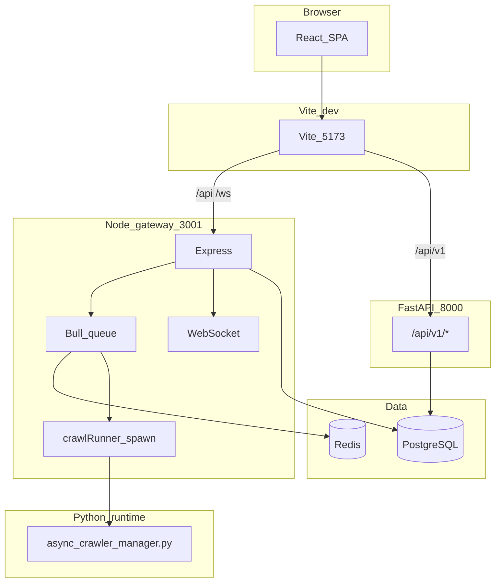
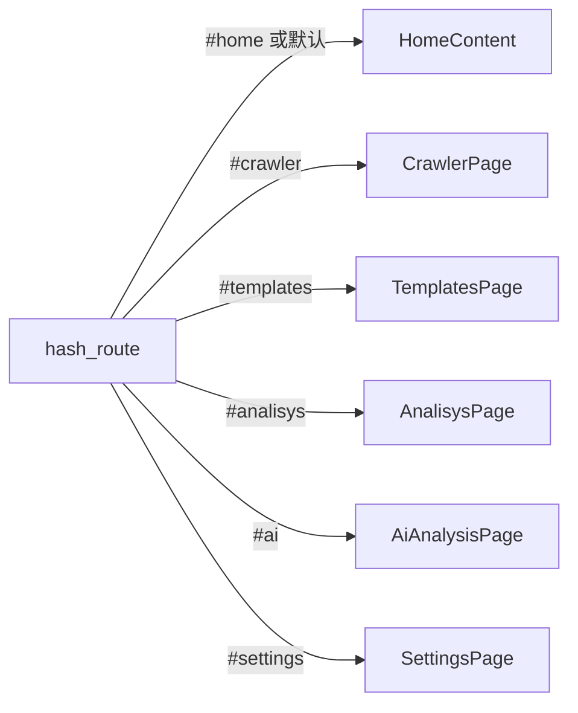
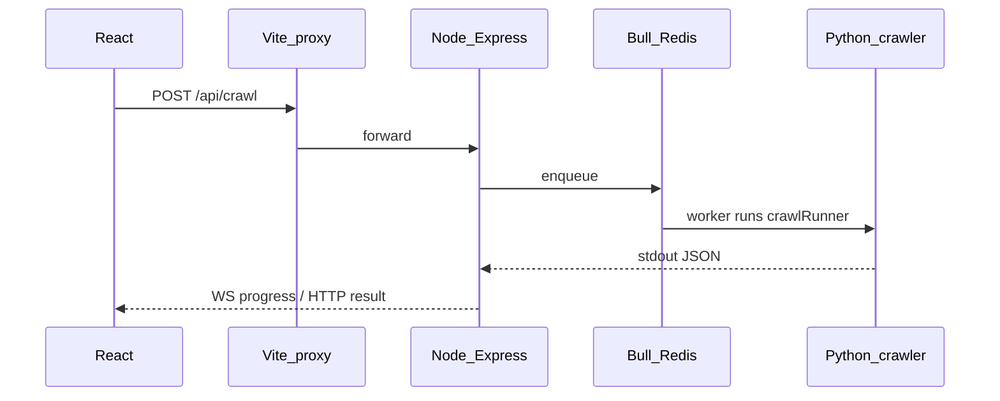

# SpiderX 全项目架构蓝图

> **版本说明**：本文描述仓库内「源代码与配置」的组织方式与运行时关系，便于新手在 15～30 分钟内建立全局认知。  
> **配套文档**：[README.md](../README.md)（启动与端口）· [API_DOCUMENTATION.md](../API_DOCUMENTATION.md)（Node HTTP）· [ARCHITECTURE_DOCUMENT.md](../ARCHITECTURE_DOCUMENT.md)（深度设计）

---

## 1. 导读

### 1.1 本文用途

- **蓝图**：说明代码放在哪、谁调用谁、用什么技术栈。  
- **非清单**：不罗列 `node_modules`、`venv`、构建产物等第三方或生成目录（见下节）。

### 1.2 建议阅读顺序

| 时间 | 建议 |
|------|------|
| 约 3 分钟 | 读「项目一句话」「功能矩阵」「技术栈表」+ 浏览两张 Mermaid 图 |
| 约 15 分钟 | 读完「运行时与数据流」「前端 / 后端蓝图」 |
| 深入 | 按目录跳转到具体文件；API 细节见 `API_DOCUMENTATION.md` |

### 1.3 本文刻意不包含的目录

以下目录**不属于项目业务源码蓝图**的一部分（体积大、可重装、或含密钥），阅读代码时请忽略或在 `.gitignore` 中已排除：

- `node_modules/`、`server/node_modules/`、`backend/.venv` 等依赖安装目录  
- `dist/` 构建输出  
- `.git/` 版本元数据  
- `venv/`（若存在于根目录，为本地 Python 环境）  
- `.cursor/`、`.claude/`、`.pytest_cache/` 等工具缓存  
- 根目录误生成的空文件（如 `my-website@0.0.0`）勿纳入架构理解  

---

## 2. 项目一句话

**SpiderX** 是一个面向开发与实验的 **网页爬虫控制台**：用户在浏览器中配置爬取任务、通过 **Node 网关** 调度 **Python 爬虫进程**，可选使用 **Redis/Bull** 队列与 **WebSocket** 查看进度；历史与分析数据可在前端展示；**FastAPI**（`backend/`）提供扩展 API（如 AI 自然语言查库），经 Vite 代理与前端对接。

---

## 3. 功能矩阵（用户可见能力）

| 功能 | Hash 路由 | 主要页面 / 组件 | 主要依赖 |
|------|-----------|-----------------|----------|
| 爬虫首页（仪表盘） | `#home` | [src/page/home/HomeComponents.tsx](../src/page/home/HomeComponents.tsx) | 本地统计、历史只读 |
| 新建爬取任务 | `#crawler` | [src/page/crawler/CrawlerPage.tsx](../src/page/crawler/CrawlerPage.tsx)、[src/js/useCrawler.ts](../src/js/useCrawler.ts) | Node `POST /api/crawl`、`/ws` |
| 模板库 | `#templates` | [src/page/templates/TemplatesPage.tsx](../src/page/templates/TemplatesPage.tsx) | 前端为主；可与 FastAPI 模板 API 扩展 |
| 数据分析 | `#analisys` | [src/page/analisys/AnalisysPage.tsx](../src/page/analisys/AnalisysPage.tsx) | localStorage / 可选后端历史 |
| AI 分析 | `#ai` | [src/page/ai/AiAnalysisPage.tsx](../src/page/ai/AiAnalysisPage.tsx) | FastAPI `/api/v1/ai/*`（需启动 8000） |
| 系统设置 | `#settings` | [src/page/settings/SettingsPage.tsx](../src/page/settings/SettingsPage.tsx) | 本地与可选 API |

全局导航：[src/components/Navbar/Navbar.tsx](../src/components/Navbar/Navbar.tsx)。路由逻辑：[src/js/AppLogic.tsx](../src/js/AppLogic.tsx)。

---

## 4. 技术栈与语言边界

| 分层 | 技术 | 语言 / 运行时 | 默认端口或入口 |
|------|------|----------------|----------------|
| 前端 SPA | React 19、TypeScript、Vite（rolldown-vite）、Tailwind CSS v4、[src/styles/app.css](../src/styles/app.css)、Redux Toolkit、Axios | TS / TSX | Vite 开发服务器 **5173** |
| 组件与文档 | Storybook、Vitest、Testing Library、Playwright（浏览器测试） | TS / TSX | `npm run storybook` / `npm run test:run` |
| 爬虫网关 | Express、Bull、`ws`、Prisma Client、部分中间件与路由 | JavaScript（[server/src](../server/src)） | **3001** |
| 爬虫子进程 | asyncio、aiohttp、BeautifulSoup 等（以脚本为准） | Python 3 | 由 `crawlRunner` `spawn`，入口 `async_crawler_manager.py` |
| 扩展 API | FastAPI、SQLAlchemy 2、Pydantic、Alembic、Celery（可选） | Python 3 | **8000**，OpenAPI `/docs` |
| 数据 | PostgreSQL、Redis（队列/缓存） | — | 按环境配置 |
| 工程化 | ESLint（flat config）、TypeScript `tsc -b`、Docker Compose（backend） | — | — |

**边界简述**：

- 浏览器只与 **Vite** 同源对话；`/api`（非 `/api/v1` 前缀）、`/ws` 被代理到 **Node 3001**；`/api/v1` 被代理到 **FastAPI 8000**（见 [vite.config.ts](../vite.config.ts)）。  
- **默认爬取主链路**不经过 FastAPI，而是 Node → Python 脚本。

---

## 5. 架构全景图（Mermaid）

### 5.1 系统与数据流（开发环境）



### 5.2 单页应用：Hash 路由与页面

路由由 `window.location.hash` 驱动（无 React Router 包时亦成立）。



懒加载定义见 [src/App.tsx](../src/App.tsx)；`pageConfigs` 见 [src/js/AppLogic.tsx](../src/js/AppLogic.tsx)。

---

## 6. 运行时与数据流（文字说明）

### 6.1 发起一次爬取（主路径）

1. 用户在 [CrawlerPage](../src/page/crawler/CrawlerPage.tsx) 提交配置。  
2. [src/services/api.ts](../src/services/api.ts) 经 Vite 代理请求 **Node** `POST /api/crawl`。  
3. [server/src/services/QueueService.js](../server/src/services/QueueService.js) 将任务放入 **Bull**（依赖 **Redis**）。  
4. [server/src/services/crawlRunner.js](../server/src/services/crawlRunner.js) 启动 Python：`src/scripts/crawler/async_crawler_manager.py`。  
5. 进度可通过 [WebSocketService](../server/src/services/WebSocketService.js) 推送到前端；前端 [websocket.ts](../src/services/websocket.ts) / [useCrawler.ts](../src/js/useCrawler.ts) 消费。

### 6.2 AI 分析路径

- 前端请求路径形如 `/api/v1/ai/...`，由 Vite 转到 **127.0.0.1:8000**。  
- 需本地启动 FastAPI（见 README）；未启动时相关页面请求会失败。

### 6.3 爬取序列图（简图）



---

## 7. 仓库目录蓝图（按树说明）

### 7.1 根目录（配置与脚本）

| 路径 | 职责 |
|------|------|
| [package.json](../package.json) | 前端脚本：`dev`（并行 server+vite）、`build`、`test`、`lint` |
| [vite.config.ts](../vite.config.ts) | React + Tailwind 插件；**开发代理** `/api`、`/api/v1`、`/ws` |
| [tsconfig.json](../tsconfig.json) / [tsconfig.app.json](../tsconfig.app.json) / [tsconfig.node.json](../tsconfig.node.json) | TS 工程引用；**应用编译范围**见 `tsconfig.app.json` 的 `exclude` |
| [eslint.config.js](../eslint.config.js) | Flat ESLint + TypeScript + Storybook 规则 |
| [vitest.config.ts](../vitest.config.ts) | Vitest 多项目（含 Storybook + Playwright） |
| [index.html](../index.html) | SPA 挂载点 |
| [tailwind.config.js](../tailwind.config.js) | Tailwind（若存在，与 v4 插件协同） |
| [README.md](../README.md) | 快速开始、端口、环境变量 |
| [API_DOCUMENTATION.md](../API_DOCUMENTATION.md) | Node API 说明 |
| [ARCHITECTURE_DOCUMENT.md](../ARCHITECTURE_DOCUMENT.md) | 长文架构 |
| [scripts/](../scripts/) | 根级辅助（如迁移、SQL 校验） |
| [.storybook/](../.storybook/) | Storybook 入口配置 |

### 7.2 `src/` 前端与爬虫脚本

| 目录 | 职责 | 关键文件 |
|------|------|----------|
| `src/page/` | 各业务页面 | `home/`、`crawler/`、`analisys/`、`templates/`、`ai/`、`settings/` |
| `src/components/` | 可复用 UI | `Navbar/`、`crawler/`（SmartUrlInput、CrawlTemplateSelector）、`ErrorBoundary.tsx`；`Button/`、`Card/`、`Input/` 等为设计系统（当前 `tsc` 可能排除，见 10 节） |
| `src/js/` | 应用逻辑与爬虫状态 | `AppLogic.tsx`、`useCrawler.ts`、`CrawlerService.ts` |
| `src/services/` | HTTP、WS、日志 | `api.ts`、`websocket.ts`、`logger.ts`；`historyApi.ts`、`analyticsApi.ts`、`settingsApi.ts` |
| `src/store/` | Redux 根与切片 | [store.ts](../src/store.ts)；`slices/`：`crawlerSlice`、`historySlice`、`settingsSlice`、`analyticsSlice`；[index.ts](../src/store/slices/index.ts) **仅聚合 reducer**，避免同名 action 从 barrel 重复导出 |
| `src/hooks/` | React 钩子 | `useTheme.ts`、`useBackendHealth.ts` |
| `src/config/` | 前端配置 | `api.ts`（`getApiBaseUrl`） |
| `src/styles/` | 全局样式与设计令牌 | `app.css`、`theme/ThemeProvider.tsx`、`tokens/*`、`utilities/` |
| `src/css/` | 历史 SCSS（部分页面可能仍引用） | `main.scss`、各页 `.scss` |
| `src/scripts/crawler/` | **由 Node 调用的 Python 爬虫** | 见 7.2.1 |
| `src/types/` | TS 类型聚合 | `index.ts` |
| `src/utils/` | 工具 | `safeStorage.ts` |
| `src/test/` | 前端测试 setup | `setup.ts`；另有 `async_crawler.test.py` 等 |
| `src/stories/` | Storybook 示例 | 与 `vitest` Storybook 项目联动 |
| [main.tsx](../src/main.tsx) | React 挂载入口 |
| [App.tsx](../src/App.tsx) | Provider、Navbar、懒加载页面切换 |

#### 7.2.1 `src/scripts/crawler/`（Python）

| 文件 / 目录 | 用途 |
|-------------|------|
| `async_crawler_manager.py` | **异步爬取入口**（Node 默认调用） |
| `async_base_crawler.py`、`async_content_crawler.py`、`async_image_crawler.py` | 异步链路爬虫实现 |
| `base_crawler.py`、`link_crawler.py`、`content_crawler.py`、`image_crawler.py`、`crawler_manager.py`、`main.py` | 同步/历史脚本路径 |
| `utils/` | 清洗、调度、UA 池、测试套件等；说明见 [utils/README.md](../src/scripts/crawler/utils/README.md) |

`utils/` 内主要 Python 文件一览：

| 文件 | 用途（摘要） |
|------|----------------|
| `data_cleaner.py` | 数据清洗 |
| `incremental_crawler.py` | 增量爬取辅助 |
| `smart_scheduler.py` | 调度逻辑 |
| `user_agent_pool.py` | User-Agent 池 |
| `professional_test_suite.py`、`fixed_test_suite.py`、`test_integration.py`、`test_compatibility_with_existing.py` | 测试与兼容性 |

### 7.3 `server/`（Node 爬虫网关）

| 路径 | 职责 |
|------|------|
| [server/src/index.js](../server/src/index.js) | Express 应用入口、核心 HTTP 路由 |
| `server/src/services/` | `crawlRunner.js`、`QueueService.js`、`WebSocketService.js` |
| `server/src/middleware/` | `auth.js`、`validation.js`、`response.js` 等 |
| `server/src/routes/` | 如 `auth.js` |
| `server/src/db.js` | 数据库访问（Prisma 等） |
| `server/prisma/` | `schema.prisma`、迁移、`prisma-pool.config.js` |
| `server/scripts/` | Prisma 生成、初始化 SQL、迁移脚本 |
| [server/package.json](../server/package.json) | 服务端依赖与 `dev`/`start` |

### 7.4 `backend/`（FastAPI 扩展）

| 路径 | 职责 |
|------|------|
| [backend/app/main.py](../backend/app/main.py) | FastAPI 实例、CORS、`include_router(..., prefix="/api")`、WebSocket |
| `backend/app/api/v1/` | `router.py` 聚合；`health.py`、`tasks.py`、`history.py`、`templates.py`、`data.py`、`field_configs.py`、`ai.py`、`auth.py` 等 |
| `backend/app/models/`、`schemas/` | SQLAlchemy 与 Pydantic |
| `backend/app/services/` | 业务服务（含 `ai_service.py`、`template_service.py`） |
| `backend/app/crawler/` | Python 侧爬虫抽象（与 Node 脚本体系并行，供扩展） |
| `backend/app/tasks/` | Celery 应用与任务定义 |
| `backend/app/ws/` | WebSocket 管理 |
| `backend/alembic/` | 数据库迁移 |
| [backend/pyproject.toml](../backend/pyproject.toml)、[docker-compose.yml](../backend/docker-compose.yml) | 依赖与本地 Redis 等 |

### 7.5 `docs/`

| 文件 | 用途 |
|------|------|
| [README.md](README.md) | 文档索引 |
| **PROJECT_BLUEPRINT.md**（本文） | 全项目蓝图 |

---

## 8. 前端模块蓝图

### 8.1 路由与懒加载

| `currentPage`（AppLogic） | Hash（Navbar 链接） | 组件 | 加载方式 |
|---------------------------|---------------------|------|----------|
| `home` | `#home` 或空 hash 时初始为 `home` | `HomeContent` | 同步 |
| `crawler` | `#crawler` | `CrawlerPage` | `React.lazy` |
| `templates` | `#templates` | `TemplatesPage` | `lazy` |
| `analisys` | `#analisys` | `AnalisysPage` | `lazy` |
| `ai` | `#ai` | `AiAnalysisPage` | `lazy` |
| `settings` | `#settings` | `SettingsPage` | `lazy` |

### 8.2 状态管理

- 全局 Store：[src/store.ts](../src/store.ts) 组合 `crawler`、`settings`、`history`、`analytics`。  
- 爬取跨页状态：[src/js/useCrawler.ts](../src/js/useCrawler.ts) 中的 `CrawlerProvider`（在 [App.tsx](../src/App.tsx) 包裹）。  
- 从 [src/store/slices/index.ts](../src/store/slices/index.ts) **只导入 reducer**；各 slice 的 action 请从具体 slice 文件导入，避免 `clearError` 等同名导出冲突。

---

## 9. 后端与扩展蓝图

### 9.1 Node 网关

- **基础 URL**（直连时）：`http://127.0.0.1:3001`；浏览器开发模式下走相对路径 `/api`。  
- 路径与响应格式详见 [API_DOCUMENTATION.md](../API_DOCUMENTATION.md)。

### 9.2 FastAPI

- 路由挂载前缀：`/api`；版本化子路径如 `/api/v1/templates`、`/api/v1/ai`。  
- 交互式文档：`http://127.0.0.1:8000/docs`。

---

## 10. 构建、测试与 `tsconfig` 排除说明

| 命令 | 作用 |
|------|------|
| `npm run dev` | 并行启动 `server`（Node）与 Vite |
| `npm run build` | `tsc -b` + `vite build` 产出 `dist/` |
| `npm run test:run` | Vitest |
| `npm run lint` | ESLint |

[tsconfig.app.json](../tsconfig.app.json) 中 **`exclude`** 包含测试文件、`src/test/`、`src/stories/`、部分 `*.stories.*` 以及 `Button`/`Card`/`Input` 目录，目的是让 **生产型 `tsc -b` 聚焦主应用**，避免 Storybook/实验组件阻塞构建；**测试仍由 Vitest 单独编译这些文件**。新手若改到被排除路径，发现 `npm run build` 不检查它们，属预期行为。

---

## 11. 附录 A：主要源文件速查（路径列表）

- 入口：`index.html`、`src/main.tsx`、`src/App.tsx`  
- 路由：`src/js/AppLogic.tsx`  
- 爬取 UI 与逻辑：`src/page/crawler/CrawlerPage.tsx`、`src/js/useCrawler.ts`  
- API / WS：`src/services/api.ts`、`src/services/websocket.ts`  
- Node 核心：`server/src/index.js`、`server/src/services/crawlRunner.js`、`QueueService.js`、`WebSocketService.js`  
- Python 入口：`src/scripts/crawler/async_crawler_manager.py`  
- FastAPI 入口：`backend/app/main.py`、`backend/app/api/v1/router.py`  
- 代理：`vite.config.ts`  

---

## 12. 附录 B：本地生成完整文件树（可选）

在仓库根目录执行（**不要**对 `node_modules`/`venv` 入库）：

```bash
find . \( -path ./node_modules -o -path ./.git -o -path ./dist -o -path ./server/node_modules -o -path ./venv \) -prune -o -type f -print | sort
```

可将输出保存为个人笔记；**团队蓝图以本文与 README 为准**，避免把数万行依赖路径写进 Git 文档。

---

## 13. 文档分工小结

| 文档 | 角色 |
|------|------|
| **docs/PROJECT_BLUEPRINT.md**（本文） | 新手蓝图：目录 + 功能 + 栈 + 图 |
| README.md | 安装、启动、端口、环境变量 |
| ARCHITECTURE_DOCUMENT.md | 深度设计与历史叙述 |
| API_DOCUMENTATION.md | Node HTTP 明细 |
